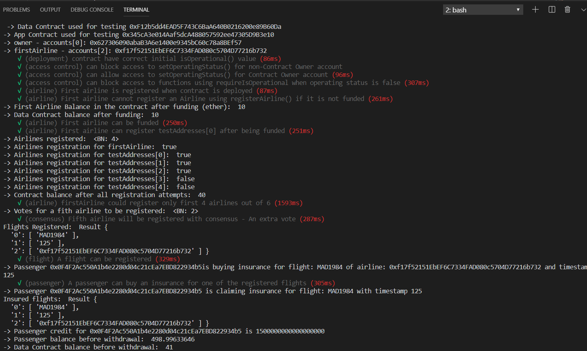
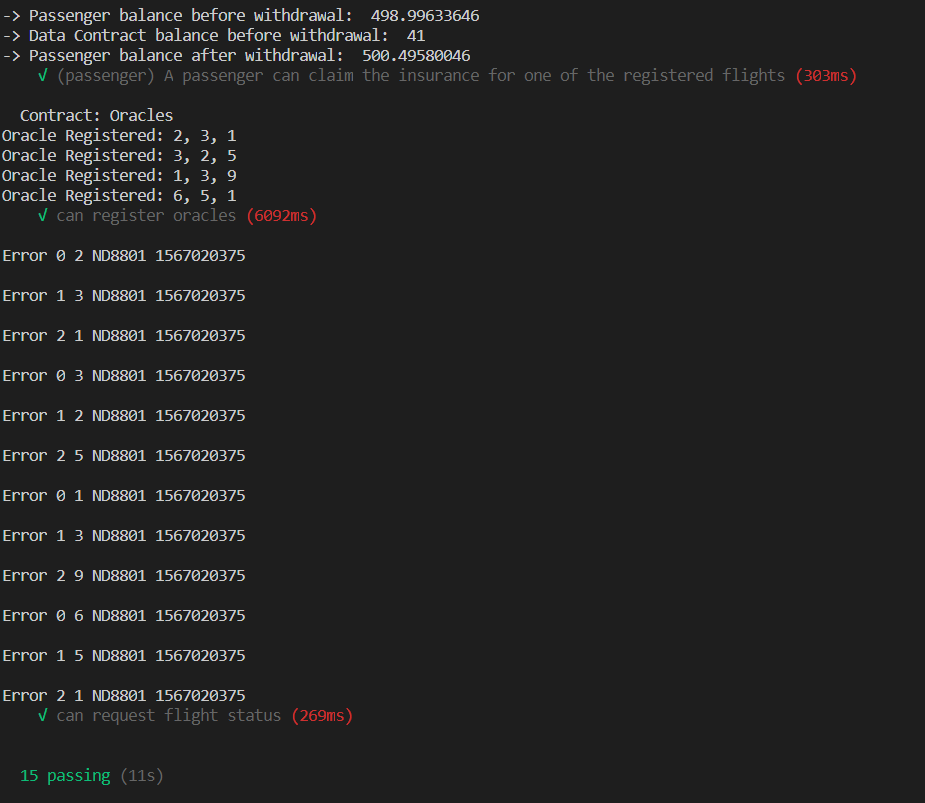

# Truffle Tests

## Environment

```

$ ganache-cli --version
Ganache CLI v6.5.0 (ganache-core: 2.6.0)

$ npm ls --depth=0
flightsurety@1.0.0 
+-- @babel/cli@7.5.5
+-- @babel/core@7.5.5
+-- @babel/plugin-proposal-class-properties@7.5.5
+-- @babel/plugin-proposal-object-rest-spread@7.5.5
+-- @babel/preset-env@7.5.5
+-- babel-core@6.26.3
+-- babel-loader@8.0.5
+-- babel-polyfill@6.26.0
+-- babel-preset-es2015@6.24.1
+-- babel-preset-stage-0@6.24.1
+-- bignumber.js@8.0.2
+-- css-loader@1.0.1
+-- express@4.16.4
+-- file-loader@3.0.1
+-- html-loader@0.5.5
+-- html-webpack-plugin@3.2.0
+-- openzeppelin-solidity@1.12.0
+-- start-server-webpack-plugin@2.2.5
+-- style-loader@0.23.1
+-- superstatic@6.0.3
+-- truffle@5.0.2
+-- truffle-hdwallet-provider@1.0.2
+-- web3@1.0.0-beta.37
+-- webpack@4.39.1
+-- webpack-cli@3.3.6
+-- webpack-dev-server@3.7.2
`-- webpack-node-externals@1.7.2

`-- truffle@5.0.2
  `-- solc@0.5.0
  
```
## Results

